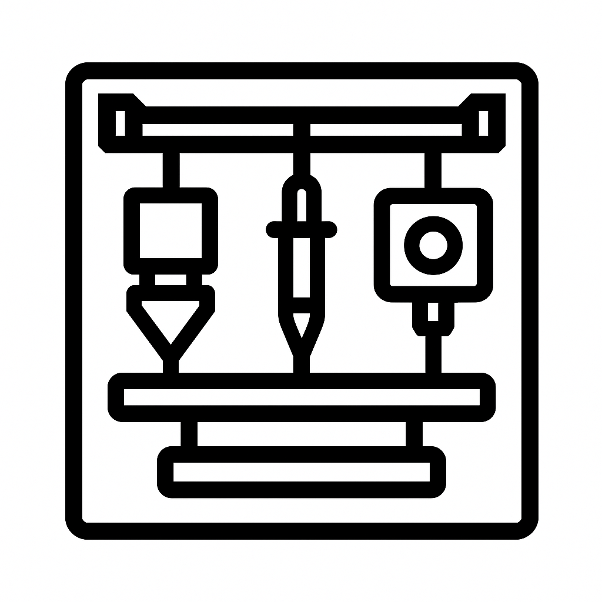

# Rister Multi-Modal Toolchanger

A sophisticated **Klipper-based** toolchanger system that integrates multiple fabrication and analysis techniques through **FDM 3D printing**, **liquid dispensing**, and **camera imaging** tools.

## Overview

Unlike traditional toolchangers that focus solely on FDM extruders, the Rister system creates a unified platform for multi-modal manufacturing and analysis built specifically for **Klipper firmware**. The system combines:

- **FDM Tools (E0, E1)**: Traditional 3D printing extruders with CAN bus control
- **Liquid Dispenser (L0)**: Precision liquid handling with linear actuator pipette
- **Camera Tool (C0)**: Programmable focus imaging with MQTT control
- **Microfluidics Integration**: Arduino-controlled wash station for liquid handling

Each tool type uses optimized communication protocols and provides comprehensive sensor feedback for reliable operation.

- **Comprehensive Safety**: Filament sensors, tool verification, and error recovery

## Key Features

- **Native Klipper Integration**: Custom Python modules and extensive G-code macro framework

- **Multi-Protocol Communication**: CAN bus for extruders, MQTT for camera, serial for microfluidics
- **Unified Tool Framework**: String-based tool IDs with consistent macro interface
- **Advanced Sensor System**: Dock/carriage detection with LED status feedback
- **Tool State Validation**: Real-time monitoring and error detection
- **Web-Based Camera Control**: Flask interface with programmable focus
- **Precision Liquid Handling**: Syringe pump with valve control and wash station
- **Configuration Files**: 20+ Klipper .cfg files for comprehensive system integration
- **Python Modules**: Custom Klipper extras (camera_dock_calibrate.py) for specialized functionality
- **G-code Macros**: Unified command interface with 50+ custom macros

## System Architecture

**Built specifically for Klipper firmware**, the Rister Multi-Modal Toolchanger extends Klipper's capabilities through custom Python modules and comprehensive G-code macro integration.

### Hardware Components

**Built specifically for Klipper firmware**, the Rister Multi-Modal Toolchanger extends Klipper's capabilities through custom Python modules and comprehensive G-code macro integration.

**Main Controller**
- BigTreeTech Octopus (STM32F446) running Klipper firmware or equivalent
- **Enhanced Gantry**: 4 Z-motors (vs. standard 3) for improved stability
- **Custom Motor Mounts**: Enhanced CoreXY mounts for multi-modal loads
- CoreXY kinematics with 480×380×250mm build volume
- Z-tilt bed leveling with four stepper motors

**Tool Controllers**
- **E0/E1 Extruders**: BTT EBB CAN boards (CAN bus communication)
  - Modified Lineux One design with Bambu Lab hotends
  - Integrated Klicky probe, filament sensors, and LED indicators
  - Custom air ducting and magnetic detachable cooling ducts
- **L0 Liquid Dispenser**: Direct GPIO control with servo linear actuator
  - Precision pipette handling with automated tip loading/unloading
  - 3-way valve system (input/output/bypass)
  - Pressure compensation vessel with level sensing
- **C0 Camera Tool**: Separate Raspberry Pi with MQTT communication
  - Arducam programmable focus camera with web interface

**Specialized Hardware**
- **Camera**: Arducam IMX519 with programmable focus (0-30 range)
- **Syringe Pump**: Stepper motor controlled via extruder interface
- **Microfluidics**: Arduino-controlled wash station with pumps and valves
- **Sensors**: Per-tool dock/carriage detection switches
- **LEDs**: NeoPixel status indicators for each tool

### Communication Protocols

**CAN Bus (Extruders)**
- BTT EBB36 boards for E0/E1 tools
- Direct Klipper stepper/heater/fan control
- Built-in filament runout sensors

**MQTT (Camera Tool)**
- Camera Pi IP: <CAMERA_PI_IP>
- Klipper Pi IP: <KLIPPER_PI_IP> (MQTT broker)
- Topics: `dakash/camera/*` and `dakash/gpio/*`

**Serial (Microfluidics)**
- Arduino connection: `/dev/ttyACM1`
- Wash/waste pump control
- Pressure compensation vessel

**HTTP (Web Interface)**
- Flask server on port 8080
- Real-time camera control and streaming
- Focus adjustment with visual feedback

## File Structure

### Required Files

**Klipper Extras Module (CRITICAL):**
```
~/klipper/klippy/extras/camera_dock_calibrate.py  # Camera dock calibration module
```

**Klipper Configuration Files:**
```
~/printer_data/config/
├── printer.cfg                    # Main Klipper printer configuration
├── unified_toolchanger.cfg        # Core toolchanger framework
├── tool_state_handlers.cfg        # Sensor monitoring and LED control
├── variables.cfg                   # Tool coordinates and statistics
├── camera_dock_calibrate.cfg      # Camera dock calibration configuration
│
├── extruder_tool_0.cfg            # E0 FDM extruder
├── extruder_tool_1.cfg            # E1 FDM extruder  
├── liquid_dispenser_0.cfg         # L0 liquid handling
├── camera_tool_0.cfg              # C0 camera tool
│
├── syringe_pump_0.cfg             # Liquid pump configuration
├── microfluidics.cfg              # Wash station control
├── tool_probe.cfg                 # Z-offset probing
├── smart_filament_sensor.cfg      # Runout detection
└── [additional configuration files]
```

**Camera Pi Scripts:**
```
~/                                  # Camera Pi home directory
├── camera_flask_mqtt.py           # Flask web interface and MQTT client
├── mqtt_unified_subscriber_fixed.py # Main MQTT subscriber service
└── start_dakash_service.py        # Service startup script
```

**Klipper Pi Scripts:**
```
~/                                  # Klipper Pi home directory
└── check_camera.sh                # Camera monitoring and verification script
```

### Prerequisites

**Hardware Requirements**
- BTT GTR mainboard with STM32F446 MCU
- 2× BTT EBB CAN boards for extruder tools
- Raspberry Pi for camera tool (tested on Pi 5)
- Arducam IMX519 camera module
- Arduino for microfluidics control
- Linear actuator servo for liquid dispenser
- NeoPixel LEDs for tool status
- Dock/carriage sensor switches per tool

**Software Requirements**
- **Klipper firmware** on main controller (required)
- Python 3.8+ on both Raspberry Pis
- MQTT broker (Mosquitto)
- Required Python packages (see requirements below)

### Klipper Configuration Setup

1. **Install Klipper extras module (REQUIRED):**
   ```bash
   # Copy the camera dock calibration module to Klipper extras
   cp camera_dock_calibrate.py ~/klipper/klippy/extras/
   
   # Restart Klipper service
   sudo systemctl restart klipper
   ```

2. **Clone or copy configuration files to Klipper config directory:**
   ```bash
   cd ~/printer_data/config
   # Copy all .cfg files from this repository
   ```

3. **Key configuration files:**
   ```
   printer.cfg              # Main printer configuration
   unified_toolchanger.cfg  # Core toolchanger framework
   tool_state_handlers.cfg  # Sensor monitoring and LED control
   variables.cfg            # Tool coordinates and statistics
   
   # Individual tool configurations
   extruder_tool_0.cfg      # E0 FDM extruder
   extruder_tool_1.cfg      # E1 FDM extruder  
   liquid_dispenser_0.cfg   # L0 liquid handling
   camera_tool_0.cfg        # C0 camera tool
   
   # Supporting systems
   syringe_pump_0.cfg       # Liquid pump configuration
   microfluidics.cfg        # Wash station control
   tool_probe.cfg           # Z-offset probing
   smart_filament_sensor.cfg # Runout detection
   ```

**Camera Dock Calibration Configuration:**

The system includes a custom Klipper extras module for camera dock calibration. Add this to your configuration:

```ini
# In camera_dock_calibrate.cfg
[camera_dock_calibrate]
xy_resolution: 0.025                    # Stepper resolution (mm/microstep)
dock_extra_offset_x_unlock: 0.0        # Extra X offset for unlock position
dock_extra_offset_y_unlock: 0.0        # Extra Y offset for unlock position  
dock_extra_offset_x_lock: 0.0          # Extra X offset for lock position
dock_extra_offset_y_lock: 0.0          # Extra Y offset for lock position

# G-code templates for calibration moves
camera_dock_calibrate_move_1_gcode:
    G28 Y
    
camera_dock_calibrate_move_2_gcode:
    G28 X
    
camera_dock_test_gcode:
    # Your camera dock test sequence
    
camera_rod_install_msg_gcode:
    RESPOND MSG="Please install camera tool rod for calibration"
```
   ```bash
   # Find your MCU serial ID
   ls /dev/serial/by-id/
   
   # Find CAN board UUIDs  
   ~/klippy-env/bin/python ~/klipper/scripts/canbus_query.py can0
   ```

7. **Configure tool dock positions in `variables.cfg`:**
   ```
   # Update these coordinates for your specific dock locations
   c0_dock_x = 145.82  # Camera tool dock
   e0_dock_x = 226.08  # Extruder 0 dock  
   e1_dock_x = 297.74  # Extruder 1 dock
   l0_dock_x = 373.53  # Liquid dispenser dock
   ```

### Camera Tool Setup (Separate Raspberry Pi)

1. **Install required packages:**
   ```bash
   sudo apt update
   sudo apt install python3-pip mosquitto-clients
   pip3 install flask paho-mqtt lgpio
   ```

2. **Enable camera and configure for libcamera:**
   ```bash
   sudo raspi-config
   # Interface Options → Camera → Enable
   
   # Test camera
   libcamera-still --output test.jpg --timeout 1000
   ```

3. **Install camera control scripts:**
   ```bash
   # Copy to home directory on Camera Pi
   cp camera_flask_mqtt.py ~/
   cp mqtt_unified_subscriber_fixed.py ~/
   cp start_dakash_service.py ~/
   
   # Make scripts executable
   chmod +x ~/start_dakash_service.py
   ```

4. **Install camera monitoring script on Klipper Pi:**
   ```bash
   # Copy to home directory on Klipper Pi (where MQTT broker runs)
   cp check_camera.sh ~/
   
   # Make script executable
   chmod +x ~/check_camera.sh
   ```

5. **Configure IP addresses in scripts:**
   ```python
   # In camera_flask_mqtt.py and mqtt_unified_subscriber_fixed.py
   MQTT_BROKER = "<KLIPPER_PI_IP>"  # Your Klipper Pi IP
   
   # In camera_control.cfg
   camera0ip = "<CAMERA_PI_IP>"   # Your Camera Pi IP
   ```

6. **Set up auto-start service:**
   ```bash
   sudo nano /etc/systemd/system/dakash-camera.service
   ```
   
   ```ini
   [Unit]
   Description=Dakash Camera Tool Service
   After=network.target
   
   [Service]
   Type=simple
   User=pi
   WorkingDirectory=/home/pi
   ExecStart=/usr/bin/python3 /home/pi/start_dakash_service.py
   Restart=always
   RestartSec=5
   
   [Install]
   WantedBy=multi-user.target
   ```
   
   ```bash
   sudo systemctl enable dakash-camera.service
   sudo systemctl start dakash-camera.service
   ```

### MQTT Broker Setup (Klipper Pi)

1. **Install Mosquitto:**
   ```bash
   sudo apt install mosquitto mosquitto-clients
   sudo systemctl enable mosquitto
   sudo systemctl start mosquitto
   ```

2. **Test MQTT communication:**
   ```bash
   # Subscribe to camera status
   mosquitto_sub -h localhost -t "dakash/camera/status"
   
   # In another terminal, trigger camera status
   mosquitto_pub -h localhost -t "dakash/camera/command" -m '{"command":"status"}'
   ```

**Arduino Microfluidics Setup**

1. **Hardware Requirements:**
   - Arduino Micro microcontroller
   - Custom PCB (Gerber and Fritzing files included)
   - Taidacent non-contact liquid level sensor
   - Servo for valve control
   - PWM-controlled pumps (wash, waste, PCV)

2. **PCB Assembly:**
   ```bash
   # Use the provided Gerber files for PCB fabrication
   # Fritzing files available for design reference and modifications
   # See arduino/gerber/ and arduino/fritzing/ directories
   ```

3. **Upload the microfluidics sketch:**
   ```bash
   # Use Arduino IDE or command line tools
   # Upload arduino/microfluidics_taidacent_noncontact_liquidlevel.ino
   # Board: Arduino Micro
   # Programmer: AVR ISP (or USB if using bootloader)
   ```

4. **Configure serial port in `microfluidics.cfg`:**
   ```
   [arduino_serial]
   serial_port: /dev/ttyACM1  # Update if different
   baud_rate: 115200
   ```

## Usage

### Basic Tool Operations

**Load Tools:**
```gcode
E0          # Load extruder tool 0
E1          # Load extruder tool 1  
L0          # Load liquid dispenser tool 0
C0          # Load camera tool 0
```

**Unload Current Tool:**
```gcode
A_1         # Unload currently active tool
```

**Tool Information:**
```gcode
# Check which tool is currently active
# Active tool shown in VARIABLES_LIST.active_tool

# View tool usage statistics  
# Statistics stored in variables.cfg
```

### FDM 3D Printing (E0, E1)

**Standard 3D printing operations:**
```gcode
# Load extruder tool
E0

# Heat and use normally
M104 S200        # Set temperature
M109 S200        # Wait for temperature
G1 E10 F300      # Extrude filament

# Tool includes:
# - Pressure advance tuning
# - Filament runout detection  
# - Part cooling fan
# - Hotend fan
# - LED status indicators
```

**Multi-color printing:**
```gcode
# Start with first extruder
E0
M104 S200
# Print first color...

# Switch to second extruder  
E1
M104 S200
# Print second color...
```

### Liquid Dispensing (L0)

**Basic liquid operations:**
```gcode
# Load liquid dispenser
L0

# Dispense liquid (amount in mm)
DISPENSE_LIQUID AMOUNT=0.5 SPEED=2

# Refill syringe from reservoir
REFILL_SYRINGE AMOUNT=5 SPEED=1

# Wash pipette tip
WASH_PIPETTE TIME=10
```

**Advanced liquid handling:**
```gcode
# Manual valve control
SYRINGE_PUMP0_VALVE_INPUT   # Set to input (refill)
SYRINGE_PUMP0_VALVE_OUTPUT  # Set to output (dispense)

# Linear actuator control
SET_SERVO SERVO=linearactuator_servo_l0 ANGLE=180  # Lower pipette
SET_SERVO SERVO=linearactuator_servo_l0 ANGLE=0    # Raise pipette

# Arduino-controlled microfluidics wash station
WASH_ON          # Turn on wash pump
WASTE_ON         # Turn on waste pump (called "dry" in Arduino)
WASH_OFF         # Turn off wash pump
WASTE_OFF        # Turn off waste pump
PCV_ON           # Pressure compensation vessel on
PCV_OFF          # Pressure compensation vessel off

# Advanced Arduino controls
SET_WASH_VAL VAL=255         # Set wash pump PWM value (0-255)
SET_DRY_VAL VAL=255          # Set waste pump PWM value (0-255)  
SET_PCV_VAL VAL=255          # Set PCV pump PWM value (0-255)
VALVE_SERVO ANGLE=90         # Control valve servo (0-180 degrees)

# Level sensor and automation
MANUAL_PCV                   # Switch to manual PCV control
FEEDBACK_PCV                 # Enable automatic level-based PCV control
READ_LEVEL_SENSOR            # Read liquid level sensor state
```

### Camera Operations (C0)

**Load camera tool:**
```gcode
C0               # Load camera tool
```

**Camera control via G-code:**
```gcode
# Basic camera functions
CAMERA_CAPTURE                    # Take high-res photo
CAMERA_STREAM_START              # Start video stream  
CAMERA_STREAM_STOP               # Stop video stream
CAMERA_STATUS                    # Get camera status

# Focus control (0=near, 30=far)
CAMERA_FOCUS_AUTO                # Enable autofocus
CAMERA_FOCUS_POSITION POSITION=15.5  # Set manual focus

# Resolution presets
CAMERA_PRESET_HIGH_RES           # 4656×3496 capture, 1920×1080 stream
CAMERA_PRESET_MEDIUM_RES         # 2328×1748 capture, 1280×720 stream  
CAMERA_PRESET_LOW_RES            # 1164×874 capture, 640×480 stream

# Help information
CAMERA_HELP                      # Show all available commands
```

**Web interface access:**
- Navigate to `http://<CAMERA_PI_IP>:8080` (camera Pi IP)
- Real-time camera control with focus slider
- Live video streaming
- Image capture and viewing

**MQTT control (advanced):**
```bash
# Direct MQTT commands to camera
mosquitto_pub -h <KLIPPER_PI_IP> -t "dakash/camera/command" \
  -m '{"command":"capture"}'

mosquitto_pub -h <KLIPPER_PI_IP> -t "dakash/camera/command" \
  -m '{"command":"focus","mode":"manual","position":20}'
```

### Tool Calibration

**Dock Position Calibration:**
```gcode
# Camera dock calibration (uses the custom Klipper extras module)
CALC_CAMERADOCK_LOCATION CAMERATOOL=0  # Calibrate camera tool dock

# Other tool dock calibration  
CALC_DOCK_LOCATION TOOL_ID="e0"       # Calibrate extruder 0
CALC_DOCK_LOCATION TOOL_ID="e1"       # Calibrate extruder 1
CALC_DOCK_LOCATION TOOL_ID="l0"       # Calibrate liquid dispenser

# Test camera dock positioning
CAMERA_DOCK_TEST                      # Test camera dock position

# Legacy compatibility commands also available:
CALIBRATE_EXTRUDER_DOCK TOOL_ID=0
CALIBRATE_CAMERA_DOCK CAMERATOOL=0    # Alternative to CALC_CAMERADOCK_LOCATION
```

**Tool Probe Calibration (E1 has Klicky probe):**
```gcode
# Z-offset calibration for tool with probe
PROBE_CALIBRATE

# Apply tool-specific Z-offsets
_APPLY_TOOL_OFFSET TOOL=1
```

### Monitoring and Diagnostics

**Sensor Status:**
```gcode
# Check all tool sensors
DEBUG_SENSOR_STATES

# Force LED updates based on sensor readings
FORCE_LED_UPDATE

# Check specific tool sensors  
CHECK_SENSORS_E0
CHECK_SENSORS_E1
CHECK_SENSORS_L0

# Camera tool sensor check (via shell script)
CHECK_CAMERA
VERIFY_CAMERA_DOCKED
VERIFY_CAMERA_PICKED
```

**Tool State Verification:**
```gcode
# Verify tool is in expected state
VERIFY_TOOL_STATE TOOL_ID=e0 DOCK=PRESSED CARRIAGE=RELEASED
VERIFY_TOOL_PICKUP TOOL_ID=e1
VERIFY_TOOL_DOCKED TOOL_ID=l0

# Check overall machine state
CHECK_MACHINE_STATE
```

**Error Handling:**
```gcode
# Reset toolchanger error state
RESET_TOOLCHANGER

# View error information
# Check VARIABLES_LIST for:
# - tc_state (0=OK, -1=Error)  
# - tc_error_code
# - error_tools (list of tools in error)
```

## Configuration

### Tool Dock Coordinates

Tool dock positions are stored in `variables.cfg` and can be updated manually or via calibration:

```ini
# Camera tool dock (C0)
c0_dock_x = 145.82
c0_dock_y = 450.81
c0_dock_z = 30.0
c0_unlock_x = 133.82
c0_unlock_y = 450.21

# Extruder tool docks (E0, E1)  
e0_dock_x = 226.08
e0_dock_y = 459.62
# ... additional coordinates

# Liquid dispenser dock (L0)
l0_dock_x = 373.53
l0_dock_y = 450.98
# ... additional coordinates
```

### Network Configuration

**IP Address Settings:**
- Klipper Pi (MQTT Broker): `<KLIPPER_PI_IP>`
- Camera Pi: `<CAMERA_PI_IP>`
- Camera Web Interface: Port `8080`

Update these in:
- `camera_control.cfg` → `camera0ip` variable
- `camera_flask_mqtt.py` → `MQTT_BROKER` setting
- `mqtt_unified_subscriber_fixed.py` → `MQTT_BROKER` setting

### Hardware Pin Assignments

**GPIO Pins (Camera Pi):**
```python
PIN_DOCK_SENSOR = 24         # Camera dock sensor
PIN_CARRIAGE_SENSOR = 23     # Camera carriage sensor  
PIN_RED_LED = 17             # Status LED red
PIN_GREEN_LED = 27           # Status LED green
PIN_BLUE_LED = 22            # Status LED blue
```

**Servo Pins (Main Controller):**
```ini
[servo linearactuator_servo_l0]
pin: PB7                     # Linear actuator servo for L0
```

**CAN Bus UUIDs:**
Update these in extruder tool configs:
```ini
[mcu EBB0]
canbus_uuid: 6ca5d6e91cd2    # Replace with your EBB0 UUID

[mcu EBB1]  
canbus_uuid: b79a52141e64    # Replace with your EBB1 UUID
```

## LED Status Indicators

Each tool has a NeoPixel LED that indicates its current state:

**LED Colors:**
- **White**: Tool docked in dock
- **Blue**: Tool mounted on carriage  
- **Red Blinking**: Error state or tool in transit
- **Yellow Breathing**: Tool heating (extruders only)
- **Cyan**: Tool idle

**LED Behavior:**
- LEDs automatically update based on dock/carriage sensor readings
- Camera tool LED managed by camera Pi MQTT service
- Manual LED control available for testing

## Safety Features

### Tool State Validation

**Sensor Monitoring:**
- Each tool has dock and carriage sensors
- Continuous monitoring detects tool state changes
- Invalid states trigger error conditions and pause prints

**Error Detection:**
- Tool not properly docked/mounted
- Communication failures (MQTT, CAN bus)
- Sensor inconsistencies
- Tool change verification failures

### Filament Management

**Smart Filament Sensors:**
- Motion sensors on E0, E1, and E2 (syringe pump)
- Delayed runout detection (ignores first 45 seconds)
- Automatic recheck system reduces false positives
- Integration with pause/resume macros

**Runout Handling:**
```gcode
# Filament sensors automatically trigger M600 (filament change)
# Manual sensor control:
SETFILAMENTSENSOR_ON T=0     # Enable sensor for tool 0
SETFILAMENTSENSOR_OFF T=1    # Disable sensor for tool 1
```

### Emergency Procedures

**Print Pause/Stop:**
```gcode
PAUSE                        # Pause print with toolhead parking
CANCEL_PRINT                 # Cancel print and reset toolchanger
RESET_TOOLCHANGER           # Reset toolchanger error state
```

**Manual Recovery:**
- Tools can be manually docked if sensors fail
- LED indicators help identify problem tools
- Error codes stored in `VARIABLES_LIST` for diagnosis

## Troubleshooting

### Common Issues

**Tool Change Failures:**
1. Check tool dock calibration: `CALC_DOCK_LOCATION TOOL_ID="xx"`
2. Verify sensor readings: `DEBUG_SENSOR_STATES`
3. Inspect LED status for visual feedback
4. Check tool dock mechanical alignment

**Camera Tool Issues:**
1. Verify MQTT broker running: `sudo systemctl status mosquitto`
2. Check camera Pi service: `sudo systemctl status dakash-camera`
3. Test camera hardware: `libcamera-still --output test.jpg`
4. Check network connectivity between Pis

**MQTT Communication:**
```bash
# Test MQTT on Klipper Pi
mosquitto_pub -h localhost -t "test" -m "hello"
mosquitto_sub -h localhost -t "test"

# Test from camera Pi  
mosquitto_pub -h <KLIPPER_PI_IP> -t "dakash/camera/command" -m '{"command":"status"}'
```

**Sensor Problems:**
1. Check GPIO pin assignments and wiring
2. Verify pull-up resistors enabled (important for camera Pi)
3. Test individual sensors: `READ_ALL_SENSORS`
4. Check sensor state variables in `TOOL_SENSOR_STATES`

**Liquid Dispensing Issues:**
1. Check syringe pump calibration
2. Verify valve operation: `SYRINGE_PUMP0_VALVE_INPUT/OUTPUT`
3. Test linear actuator: `SET_SERVO SERVO=linearactuator_servo_l0 ANGLE=xx`
4. Check microfluidics Arduino connection

### Diagnostic Commands

**System Status:**
```gcode
DEBUG_SENSOR_STATES          # Show all sensor readings
CHECK_MACHINE_STATE          # Overall system status  
CAMERA_STATUS               # Camera system status
QUERY_CAMERA                # Camera sensor status via MQTT
```

**Tool Verification:**
```gcode
VERIFY_CURRENT_TOOL         # Check active tool state
VERIFY_TOOL_STATE TOOL_ID=e0 DOCK=PRESSED CARRIAGE=RELEASED
CHECK_CAMERA                # Camera-specific checks
```

**Communication Tests:**
```bash
# MQTT testing (run on Klipper Pi)
mosquitto_sub -h <KLIPPER_PI_IP> -t "dakash/+/+"

# Camera shell script (run on Klipper Pi)
~/check_camera.sh verify_docked
~/check_camera.sh verify_picked
```

### Log Files

**Klipper Logs:**
```bash
tail -f ~/printer_data/logs/klippy.log
```

**Camera Service Logs:**
```bash
sudo journalctl -u dakash-camera -f
```

**MQTT Debug:**
```bash
mosquitto_sub -h localhost -t "dakash/+/+" -v
```

## Hardware Specifications

### PCB Manufacturing

**Custom Arduino Micro PCB:**
The microfluidics controller uses a custom PCB designed for the Arduino Micro with integrated connections for all components.

**Manufacturing Files:**
- **Gerber Files**: Located in `arduino/gerber/` - send these to any PCB manufacturer
- **Fritzing Files**: Located in `arduino/fritzing/` - for design reference and modifications

**PCB Features:**
- Direct Arduino Micro integration
- Screw terminals for pump connections
- Dedicated sensor input connectors
- Servo control headers
- Power distribution and regulation
- Compact design for integration into the toolchanger system

**Recommended PCB Specs:**
- 2-layer PCB
- 1.6mm thickness
- HASL finish
- Standard via sizes

**Main Controller:**
- BigTreeTech GTR v1.0
- STM32F446 MCU
- Klipper firmware

**CAN Bus Tools:**
- BTT EBB36 CAN boards
- 120Ω termination resistors
- Twisted pair CAN wiring

**Camera System:**
- Raspberry Pi 5 (also compatible with Pi 4)
- Arducam IMX519 16MP camera
- Programmable focus range: 0-30
- Resolution up to 4656×3496

**Arduino Hardware:**
- **Arduino Micro** microcontroller (custom PCB design)
- **Custom PCB** with integrated connections (Gerber files provided)
- Serial communication at 115200 baud via USB
- Taidacent non-contact liquid level sensor (pin A2)
- Servo valve control (pin 11)
- PWM pump control (pins 5, 6, 9, 10)
- Thermistor temperature sensor (pin A0)

**Custom PCB Design:**
The system includes a custom PCB design for the Arduino Micro with integrated connections for all microfluidics components:
- **Gerber Files**: Ready for PCB fabrication by any PCB manufacturer
- **Fritzing Files**: Source design files for modifications and reference
- **Component Integration**: All sensors, pumps, and servos connect directly to the PCB

**Arduino Micro Pin Assignments:**
```cpp
// From microfluidics_taidacent_noncontact_liquidlevel.ino
int valveservo = 11;      // Valve servo control
int washpin = 10;         // Wash pump PWM
int drypin = 9;           // Waste pump PWM
int pcvpin = 6;           // Pressure compensation vessel
int heatpin = 5;          // Heater control
int turnon5vpin = 5;      // 5V power control
const int sensorPin = A2; // Liquid level sensor
#define THERMISTOR_PIN A0 // Temperature sensor
```

**Arduino Commands:**
The Arduino sketch responds to serial commands:
- `washon/washoff` - Control wash pump
- `dryon/dryoff` - Control waste pump  
- `pcvon/pcvoff` - Control pressure compensation
- `valveservo XX` - Set valve servo angle (0-180)
- `setwashval XXX` - Set wash PWM value (0-255)
- `setdryval XXX` - Set waste PWM value (0-255)
- `setpcvval XXX` - Set PCV PWM value (0-255)
- `manpcv/feedbackpcv` - Manual/automatic PCV control
- `readpin` - Read liquid level sensor
- `info` - Get system information

### Wiring Requirements

**Power:**
- 24V main power for printer
- 5V logic power for CAN boards  
- Separate 5V supply for camera Pi recommended

**Communication:**
- CAN bus: Twisted pair, 120Ω terminated
- Ethernet: Both Pis on same network
- USB: Arduino to Klipper Pi
- GPIO: Sensors and LEDs per tool

**Safety:**
- All tools have independent dock/carriage sensors
- Emergency stop integration
- LED status indicators for visual feedback

## Advanced Features

### Native Klipper Integration

**Custom Python Modules:**
- **camera_dock_calibrate.py**: Specialized camera dock positioning with automatic calibration
- **Integrated G-code Macros**: 50+ macros for unified tool control interface
- **Real-time Sensor Integration**: Direct integration with Klipper's sensor framework

**Klipper-Native Features:**
- **Tool State Management**: Uses Klipper's variable system for persistent tool tracking
- **Sensor Monitoring**: Integrated with Klipper's probe and sensor infrastructure  
- **Motor Control**: Direct stepper motor control for syringe pumps and linear actuators
- **Temperature Management**: Full integration with Klipper's heater control system

### Tool Usage Statistics

The system tracks detailed usage statistics for each tool:

```gcode
# View statistics in variables.cfg:
# - Total tool changes and time spent
# - Per-tool mount/unmount counts  
# - Heater active/standby time tracking
# - Tool usage counters
```

### Multi-Protocol Integration

**Unified Tool Framework:**
- String-based tool IDs (e0, e1, c0, l0)
- Consistent macro interface across all tools
- Protocol-agnostic tool state management
- Automatic tool-specific activation

**Communication Protocols:**
- **CAN Bus**: High-speed, reliable for extruders
- **MQTT**: Flexible, networked for camera systems  
- **Serial**: Simple, direct for microfluidics
- **HTTP**: User-friendly web interface

### Research Applications

**Multi-Modal Manufacturing:**
- Print → Image → Dispense → Analysis workflows
- Automated quality control with camera feedback
- In-situ liquid application during printing
- Real-time process monitoring and adjustment

**Liquid Handling Capabilities:**
- Precision dispensing (μL quantities)
- Multiple liquid types via wash station
- Automated pipette tip changing
- Integration with microfluidics protocols

## License

*Specify your license here (MIT, GPL, Apache, etc.)*

## Contributing

Contributions are welcome! Please:

1. Fork the repository
2. Create a feature branch
3. Test thoroughly with the multi-modal system
4. Submit a pull request with detailed description

### Development Guidelines

- Follow Klipper configuration conventions
- Test all tool types when making changes
- Update documentation for new features
- Maintain backward compatibility where possible

## Acknowledgments

- Klipper firmware team for the excellent foundation
- BTT for CAN bus toolboard development  
- Arducam for programmable focus camera modules
- MQTT and Flask communities for communication tools
- Contributors to the toolchanger and liquid handling communities

## Support

- **Issues**: Report bugs via GitHub Issues
- **Discussions**: Use GitHub Discussions for questions
- **Documentation**: Check this README and configuration comments
- **Community**: Share improvements and modifications

---

**Rister Multi-Modal Toolchanger** - Advancing multi-protocol manufacturing through integrated FDM, liquid handling, and imaging capabilities with native **Klipper firmware** integration.

*Last updated: July 2025*
