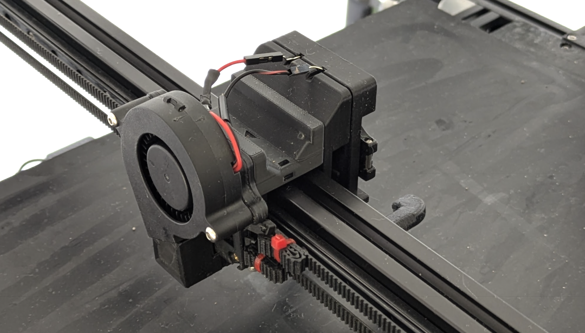
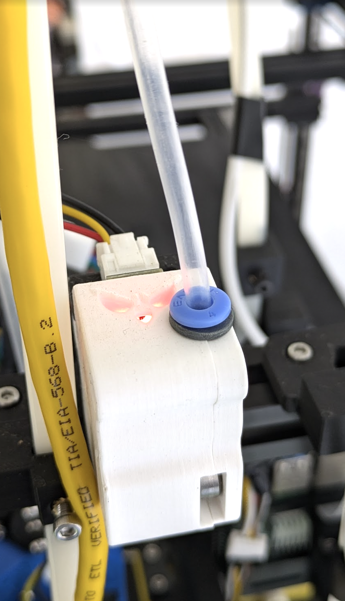
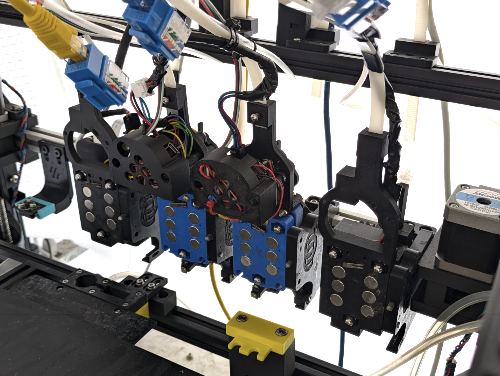
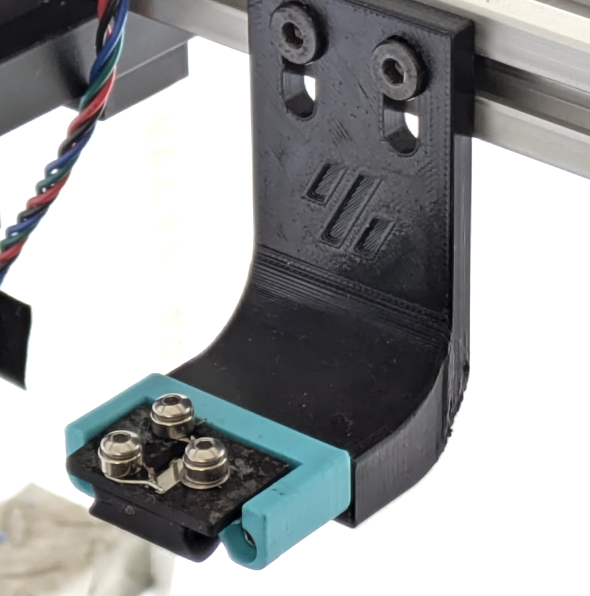

# Rister Multi-Modal Toolchanger - System Overview

This directory contains visual documentation of the complete Rister Multi-Modal Toolchanger system, showcasing the integration of FDM printing, liquid dispensing, and camera imaging capabilities within a single Klipper-based platform.

## System Architecture

The Rister Multi-Modal Toolchanger represents a paradigm shift from traditional single-purpose 3D printers to a comprehensive manufacturing and analysis platform. The system seamlessly integrates three distinct tool types:

### **Multi-Modal Integration**
- **FDM Tools (E0, E1)**: High-precision 3D printing with Bambu Lab hotends
- **Liquid Dispenser (L0)**: Automated pipette handling with precision volume control  
- **Camera Tool (C0)**: Programmable focus imaging for quality control and analysis

### **Enhanced Gantry Design**
- **4-Motor Z-Axis**: Improved stability compared to standard 3-motor configurations
- **Custom CoreXY Motor Mounts**: Enhanced rigidity for multi-modal operations
- **Optimized Tool Spacing**: Accommodates diverse tool geometries and dock mechanisms

### **Unified Control System**
- **Klipper Firmware**: Native integration with custom Python modules
- **Mixed Communication**: CAN bus for extruders, MQTT for camera, direct GPIO for liquid handling
- **Comprehensive Sensor Network**: Real-time tool state monitoring and validation

## Component Gallery

### 1. Carriage with Removable Duct

  
  
<em>Advanced carriage design featuring magnetically attachable cooling duct for optimized airflow control</em>

**Key Features:**
- **Magnetic Attachment**: Quick-change cooling duct system
- **Optimized Airflow**: Directed cooling for improved print quality
- **Tool-Specific Design**: Compatible with Bambu Lab hotend integration
- **Easy Maintenance**: Removable design for cleaning and replacement

---

### 2. Filament Sensor Integration

  
  
<em>Custom filament motion sensor based on Tircown design with ERCF PCB integration</em>

**Technical Specifications:**
- **Design Base**: Modified [Tircown Filament Motion Sensor](https://github.com/Tircown/VoronFrenchUsers/tree/main/Mod/Filament_motion_sensor)
- **Hardware**: Blinky ERCF PCB for reliable motion detection
- **Smart Detection**: Advanced filtering to prevent false runout alerts
- **Klipper Integration**: Native support with configurable sensitivity

---

### 3. Docked Tools - Rear View

  
  
<em>Rear perspective showing the organized dock layout and cable management for all three tool types</em>

**System Layout:**
- **Left**: Liquid dispenser with linear actuator pipette loader
- **Center**: FDM extruder with integrated sensors and cooling
- **Right**: Camera tool with Raspberry Pi integration
- **Cable Management**: Organized routing for power, data, and pneumatic connections

---

### 4. Docked Tools - Front View

  
  
<em>Front perspective highlighting the user-facing interfaces and operational components</em>

**Operational Overview:**
- **Tool Identification**: Visual differentiation between tool types
- **Status Indicators**: LED feedback systems for each tool
- **Access Points**: User-accessible components for maintenance and operation
- **Safety Features**: Clear sightlines for tool change verification

---

### 5. Klicky Probe Mount

  
  
<em>Custom Klicky probe mount adapted for the multi-modal toolchanger system</em>

**Probe System Features:**
- **Modified Klicky Design**: Adapted for toolchanger compatibility
- **Tool-Specific Calibration**: Individual Z-offset compensation per tool
- **Magnetic Docking**: Reliable attachment and release mechanism
- **High Precision**: Accurate bed leveling and tool offset measurement

## Design Philosophy

### **Modularity and Precision**

The Rister system prioritizes modular design principles while maintaining the precision required for multi-modal manufacturing:

- **Standardized Interfaces**: Common mounting and electrical connections across all tools
- **Independent Optimization**: Each tool optimized for its specific manufacturing process
- **Scalable Architecture**: Framework designed to accommodate future tool types
- **Precision Engineering**: Micron-level accuracy maintained across all operations

### **Manufacturing Integration**

The system enables seamless workflows combining multiple manufacturing paradigms:

- **Print → Analyze → Dispense**: Integrated quality control and post-processing
- **Real-time Monitoring**: Camera feedback during printing operations  
- **Automated Liquid Handling**: Precision dispensing for functional printing
- **Multi-material Capabilities**: FDM tools support diverse material types

### **Safety and Reliability**

Comprehensive safety systems ensure reliable operation:

- **Tool State Validation**: Real-time sensor feedback and verification
- **Error Detection**: Automated detection of tool change failures
- **Emergency Procedures**: Safe shutdown and recovery protocols
- **Status Visualization**: LED feedback and web interface monitoring

---

*This system overview demonstrates the sophisticated integration of multiple manufacturing technologies within the Rister Multi-Modal Toolchanger platform. Each component is designed for precision, reliability, and seamless operation in multi-modal manufacturing workflows.*
