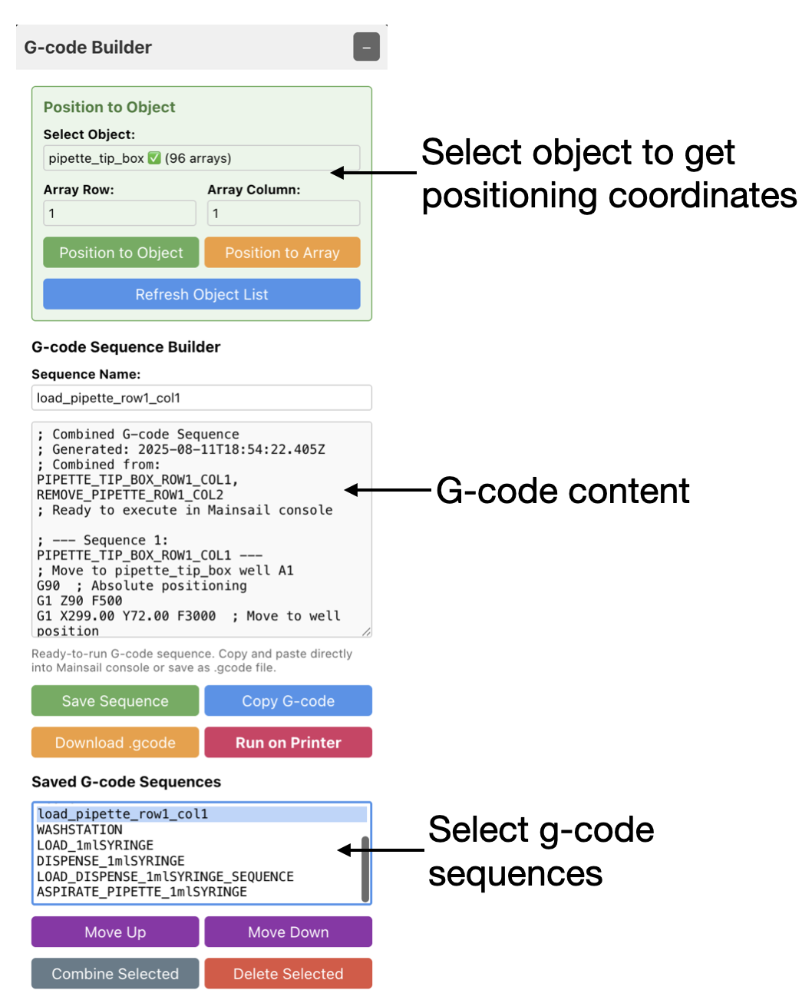

# Tip Management System:

- Linear actuator for automated tip loading and removal
- Mechanical removal tool with overhang design
- Consistent tip sealing for accurate volume delivery
- Contamination-free tip disposal
- Cleaning System Issues

<!--
**Symptom:** Ineffective cleaning
- **Cause:** Insufficient cleaning fluid flow or improper waste removal
- **Check:** Peristaltic pump operation and fluid levels
- **Solution:** Verify all pumps are operational, check cleaning fluid supply# Linear Actuator Pipette Operations
-->


<!--
This tutorial covers the linear actuator pipette tool (L0) with your Rister Toolchanger, including the fluid management system design, operational principles, and cleaning procedures.
-->


## Overview

The linear actuator driven pipetting system provides precise liquid handling capabilities through an integrated fluid management system. The tool combines pressure-controlled dispensing with automated cleaning for reliable, repeatable liquid operations and a control interface that works with Mainsail that includes expanded user inteface for controlling fluidics.


## System Architecture


*System diagram showing the complete fluidic path and component relationships*

### Fluid Management System

The pipette system maintains precise liquid control through several integrated components:

**Pressure Compensation Reservoir:**
The system includes a pressure compensation vessel equipped with a liquid level sensor. When the sensor detects that the fluid level has dropped below the set point, a peristaltic pump automatically draws fluid from the water bottle to refill the vessel and maintain the proper level.

**Fluid Dispensing Operation:**
The pipette draws fluid from the pressure compensation vessel using a syringe pump connected through a 3-way valve system:

- **Input position:** The valve draws fluid from the pressure compensation vessel into the syringe
- **Output position:** The valve directs fluid from the syringe through the pipette for dispensing  
- **Bypass position:** The valve maintains pressure within the pipette system, keeping the liquid level stable at the tip

### Why Pressure Control is Critical

Maintaining stable pressure in the pipette is essential for accurate liquid handling. Without proper pressure control, several problems occur:

**System Failures Without Pressure Control:**
- **Dripping:** Low pressure allows liquid to drip uncontrollably from the tip, causing volume loss and contamination
- **Air bubbles:** Pressure fluctuations can draw air into the liquid column, disrupting volume accuracy
- **Inconsistent dispensing:** Varying pressure leads to unpredictable droplet formation and unreliable volume delivery
- **Meniscus instability:** The liquid surface at the tip becomes unstable, making precise volume measurements impossible

The bypass position of the 3-way valve creates a sealed system that maintains consistent pressure, ensuring the liquid remains at the optimal position for accurate, repeatable dispensing.

### Automated Cleaning System

**Cleaning Process:**
When the pipette is positioned over the wash basin, the system can perform automated cleaning:

- The syringe pump pushes cleaning fluid through the internal pipette channels
- A separate peristaltic pump provides external washing of the pipette exterior  
- Waste fluid is removed from the wash basin via another peristaltic pump that transfers it to a waste bottle

This design creates a closed-loop fluid handling system with automated filling, precise dispensing control, and integrated cleaning capabilities.

## Mainsail Control Interface

The Rister pipette system includes three custom Tampermonkey scripts that provide enhanced control interfaces within Mainsail. These tools are essential for efficient pipette operations, allowing you to define workspace objects, generate G-code sequences, and control fluidic components directly from the web interface.

### Script Installation

The Rister pipette system requires two custom Tampermonkey scripts to enable the enhanced control interfaces. For complete installation instructions, see the [Tampermonkey Setup Guide](https://github.com/htsrjdrouse/rister-toolchanger/blob/main/tampermonkey/README.md).

Once installed, you should see three new panels appear in your Mainsail interface: Object Editor, G-code Builder, and Fluidics Control.

### Object Editor Interface


The Object Editor provides comprehensive workspace management for defining laboratory objects and their positions on the printer bed. This interface is essential for creating repeatable, automated workflows.

**Key Components:**

**Define Printer Area:** Configure your printer's working dimensions to match your physical setup. The system uses these boundaries to validate object positions and provide accurate coordinate mapping.

**Defined Objects:** Visual representation of all objects on the printer bed. Objects are displayed with their actual sizes and array configurations, allowing you to verify positioning before running operations.

**Objects List:** Interactive list showing all created objects with their key properties including position coordinates, dimensions, and array configurations. Click any object to edit its properties.

**Object Properties:** Detailed configuration panel for each object including:
- Position coordinates (X, Y, Z)
- Object dimensions and shapes  
- Array configurations (rows, columns, spacing)
- Margin and offset settings
- Visual appearance properties

**Functional Capabilities:**
- Create new objects with customizable properties
- Clone existing objects for similar setups
- Visual positioning with grid overlay
- Array definition for multi-well plates or tip racks
- Export/import configurations for setup sharing
- Real-time coordinate generation

### G-code Builder Interface  



The G-code Builder transforms defined objects into executable printer commands, enabling automated movement sequences and complex operational workflows.

**Key Components:**

**Select Object to Get Positioning Coordinates:** Choose from your defined objects and specify array positions to generate precise movement commands. The interface calculates exact coordinates based on object definitions and array configurations.

**G-code Content:** Real-time generation of executable G-code sequences with proper formatting for Mainsail console execution. Commands include movement instructions, positioning data, and operational parameters.

**Select G-code Sequences:** Saved sequence management allowing you to store, organize, and combine multiple operation sequences. This enables building complex protocols from simpler components.

**Operational Features:**
- Automatic coordinate calculation from object definitions
- Array-specific positioning (e.g., well A1, B3, etc.)
- Sequence combination and reordering
- Direct execution via "Run on Printer" functionality
- Export capabilities for external use
- Template generation for common operations

### Fluidics Control Interface


The Fluidics Control panel provides direct control over all liquid handling components, enabling manual operation and system management.

**Key Components:**

**Adjust Pipette Linear Actuator:** Precise control of the pipette positioning mechanism with preset angles (Up 0°, Mid 90°, Down 180°) and custom positioning. Includes auto-disable timeout to prevent servo overheating and power management features.

**Select Pipette Type:** Choose between P100 (small volume) and P300 (standard volume) tip configurations. This selection affects positioning calculations and ensures proper tip sealing and operation.

**Liquid Handling Functions:** Comprehensive control of all fluidic system components including:
- Pressure Control Valve (PCV) operation in feedback or manual mode
- Wash system control (on/off operation) 
- Waste management system control
- 3-way valve positioning (Input, Output, Bypass)
- Positioning commands for wash and waste stations
- Pipette ejection functionality
- Touch-dry operations

**System Management Features:**
- Real-time status monitoring
- Timed wash cycles with customizable duration
- Safety interlocks and error reporting
- Position memory and restoration
- Direct G-code command transmission

### Integration Benefits

**Coordinated Operation:** All three interfaces work together to provide seamless laboratory automation:

1. **Object Editor** defines the physical workspace and object locations
2. **G-code Builder** converts object definitions into movement sequences  
3. **Fluidics Control** manages liquid handling operations at those positions

**Workflow Efficiency:** The integrated system eliminates manual coordinate calculation, reduces setup time, and ensures consistent operations across different users and sessions.

**Error Prevention:** Visual feedback and validation prevent positioning errors, collision risks, and operational mistakes that could damage equipment or compromise experiments.

**Protocol Development:** The combination enables rapid development and testing of automated protocols, with the ability to save, share, and modify operational sequences.


## Examples ##

** Pipette loading, aspiration and dispense**
https://www.youtube.com/watch?v=jGlJavWvzJA


[](https://www.youtube.com/watch?v=jGlJavWvzJA)


*Click the thumbnail above to watch the video*


The corresponding gcode file is: [loading_aspiration_ejection.gcode](gcodes/loading_aspiration_ejection.gcode)


** Sample loading and washing**
https://www.youtube.com/watch?v=ymJJTOd5sF0


[](https://www.youtube.com/watch?v=ymJJTOd5sF0)


*Click the thumbnail above to watch the video*


The corresponding gcode file is: [loading_aspiration_ejection.gcode](gcodes/POSITION_WATERWELL_ASPIRATE_WASHINOUT.gcode)


## Prerequisites

- ✅ Rister Toolchanger calibrated and homed (see [Tool Calibration and Homing](01-calibration-and-homing.md))
- ✅ Linear actuator pipette tool (L0) properly mounted and configured
- ✅ Fluid management system filled and pressurized
- ✅ Cleaning system operational with wash basin positioned
- ✅ Waste collection system connected and functional
- ✅ **Tampermonkey scripts installed and operational in browser**
- ✅ **Mainsail control interfaces configured and tested**

## Safety First

⚠️ **Before using the pipette tool:**
1. Ensure all fluid containers are properly secured
2. Verify waste collection system is operational  
3. Check that cleaning solutions are compatible with intended fluids
4. Confirm pipette tip is clean and unobstructed
5. Validate pressure compensation system is functioning

## Step 1: Pipette Tool Pickup and Verification

### Basic Tool Operations

```gcode
# Pick up linear actuator pipette tool
L0

# Verify tool is properly connected to carriage
VERIFY_TOOL_STATE tool_id=L0 dock=PRESSED carriage=RELEASED
```

## Step 2: Pipette Tip Management

### Understanding Tip Loading and Removal

**Linear Actuator Operation:**
The integrated linear actuator provides precise control for tip attachment:
- Extends pipette into tip with controlled force
- Ensures proper sealing without over-compression
- Retracts to normal operating position after tip attachment

**Tip Removal Mechanism:**
The mechanical removal system ensures reliable tip ejection:
- Fixed overhang positioned at predetermined location
- Pipette approaches from below with used tip
- Upward movement catches tip lip on overhang edge
- Continued upward motion pulls tip off and drops into waste

### Tip Management Workflow

**Loading Fresh Tip:**
1. Position pipette tool over tip supply location
2. Align pipette with individual tip
3. Activate linear actuator to extend pipette into tip
4. Apply sufficient pressure to create seal
5. Retract actuator to normal position
6. Verify tip is securely attached

**Removing Used Tip:**
1. Position pipette tool underneath removal overhang
2. Align tip with overhang lip
3. Move pipette upward to catch tip on overhang
4. Continue upward motion to pull tip off pipette
5. Move away, allowing tip to drop into waste collection

## Step 3: Understanding the Fluid Management Process

### System Components in Operation

**Linear Actuator for Tip Management:**
The pipette tool includes a linear actuator that enables automated loading and removal of pipette tips:
- **Tip Loading:** Linear actuator extends to press pipette into tip, creating secure seal
- **Tip Removal:** Actuator can eject tips directly or position for mechanical removal
- **Precise Control:** Ensures consistent tip seating for accurate volume delivery

**Pipette Tip Removal Tool:**
A dedicated removal mechanism provides reliable tip ejection:
- **Overhang Design:** Fixed overhang positioned above pipette path
- **Mechanical Operation:** Pipette moves up underneath overhang, catching the tip lip
- **Automated Removal:** Upward motion pulls tip off pipette and drops into waste
- **No Cross-Contamination:** Tips removed without direct contact with other surfaces

**Pressure Compensation Vessel:**
- Maintains stable fluid pressure for consistent dispensing
- Automatically refills when liquid level drops below setpoint
- Prevents air introduction into the fluid lines

**3-Way Valve Positions:**
- **Input Position:** Allows syringe to draw fluid from pressure vessel
- **Output Position:** Directs fluid from syringe through pipette for dispensing
- **Bypass Position:** Maintains system pressure and meniscus stability

**Syringe Pump Control:**
- Provides precise volume control for fluid loading and dispensing
- Can operate in both draw and dispense modes
- Integrates with valve positions for complete fluid control

### Operational Workflow

**Loading New Pipette Tip:**
1. Position pipette tool over tip supply/magazine
2. Use linear actuator to extend pipette into tip
3. Apply controlled pressure to create secure seal
4. Verify tip is properly seated and sealed

**Dispensing Fluid:**
1. Position pipette tool over target location
2. Switch valve to output position
3. Use syringe pump to dispense precise volume
4. Return valve to bypass position to prevent dripping

**Removing Used Pipette Tip:**
1. Position pipette underneath removal tool overhang
2. Align pipette tip with overhang lip
3. Use linear actuator or Z-axis movement to lift pipette up
4. Upward motion catches tip on overhang, pulling it off pipette
5. Tip drops into waste collection area

**Maintaining Pressure:**
1. Keep valve in bypass position when not actively loading or dispensing
2. Monitor pressure compensation vessel level
3. Automatic refill maintains consistent system pressure

## Step 4: Cleaning Procedures

### Understanding the Cleaning System

**Internal Channel Cleaning:**
- Syringe pump pushes cleaning fluid through internal pipette channels
- Removes residual liquids and prevents cross-contamination
- Essential when switching between different fluid types

**External Surface Cleaning:**
- Separate peristaltic pump provides external washing of pipette exterior
- Removes external contamination and splashes
- Important for maintaining sterile conditions

**Waste Management:**
- Dedicated peristaltic pump removes waste fluid from wash basin
- Transfers waste to collection bottle
- Prevents overflow and contamination of work area

### Cleaning Workflow

**Positioning for Cleaning:**
1. Move pipette tool to wash basin location
2. Lower to appropriate height for cleaning operations
3. Ensure proper alignment with cleaning nozzles

**Cleaning Sequence:**
1. Internal cleaning: Flush cleaning fluid through pipette channels
2. External cleaning: Wash exterior surfaces with cleaning solution
3. Waste removal: Pump waste fluid to collection bottle
4. Final rinse: Clear system with clean fluid

## Step 5: Tool Return and System Management

### Proper Shutdown Sequence

```gcode
# Return pipette tool to dock
A_1

# Verify tool is properly docked
VERIFY_TOOL_STATE tool_id=L0 dock=PRESSED carriage=RELEASED
```

### System Considerations

**Between Operations:**
- Keep valve in bypass position to maintain pressure
- Monitor fluid levels in pressure compensation vessel
- Ensure cleaning system is ready for next use

**End of Session:**
- Perform complete cleaning cycle
- Empty pipette system if required
- Secure all fluid containers
- Document any maintenance needs

## System Design Benefits

### Closed-Loop Operation

**Automated Fluid Management:**
- Pressure compensation maintains consistent conditions
- Automatic refilling prevents system interruption
- Waste management handles cleanup automatically

**Precision Control:**
- 3-way valve system provides precise fluid routing
- Syringe pump enables accurate volume control
- Pressure maintenance ensures repeatable results

**Contamination Prevention:**
- Integrated cleaning system reduces cross-contamination
- Closed-loop design minimizes exposure to environment
- Automated waste handling maintains clean workspace
- Tip removal system prevents direct contact with contaminated tips

**Tip Management Benefits:**
- Linear actuator ensures consistent tip seating
- Mechanical removal prevents tip handling contamination
- Automated tip change enables sterile operations
- Waste collection system maintains clean work area

## Troubleshooting

### Pressure System Issues

**Symptom:** Liquid dripping from pipette tip
- **Cause:** Insufficient pressure in bypass mode
- **Check:** Pressure compensation vessel level and valve position
- **Solution:** Verify system is in bypass position, refill pressure vessel if needed

**Symptom:** Air bubbles in liquid column
- **Cause:** Pressure fluctuations during fluid loading
- **Check:** Valve operation and pressure vessel status
- **Solution:** Re-prime system, check for leaks in fluid lines

### Dispensing Accuracy Problems

**Symptom:** Inconsistent volume delivery
- **Cause:** Pressure instability or valve timing issues
- **Check:** Valve position switching and pressure maintenance
- **Solution:** Verify valve operates correctly, maintain bypass position when not dispensing

**Symptom:** Poor drop formation
- **Cause:** Pipette tip contamination or meniscus instability  
- **Check:** Tip cleanliness and pressure system function
- **Solution:** Clean pipette tip, verify pressure compensation is working

### Tip Management Issues

**Symptom:** Pipette tip not seating properly
- **Cause:** Insufficient linear actuator extension or misalignment
- **Check:** Tip supply positioning and actuator operation
- **Solution:** Verify alignment, check actuator force settings

**Symptom:** Tip removal failure
- **Cause:** Misalignment with removal overhang or insufficient upward motion
- **Check:** Pipette positioning relative to overhang
- **Solution:** Verify overhang alignment, ensure adequate vertical travel

**Symptom:** Tips falling off during operation
- **Cause:** Inadequate sealing pressure during tip loading
- **Check:** Linear actuator extension force and tip compatibility
- **Solution:** Increase sealing pressure, verify tip size match

## Technical Specifications

### System Capabilities

**Volume Range:**
- Dependent on syringe pump specifications
- Typical range: 1μL to 1000μL
- Accuracy dependent on pressure stability and valve precision

**Pressure System:**
- Maintains stable pressure through compensation vessel
- Automatic level monitoring and refill
- Prevents contamination through closed-loop design

**Cleaning System:**
- Internal channel flushing capability
- External surface washing
- Automated waste collection and removal

## Next Steps

After understanding pipette system operation:
1. **Multi-Tool Workflows** - Learn to combine pipette with camera for guided dispensing
2. **Protocol Development** - Create standardized liquid handling procedures
3. **System Integration** - Incorporate pipette operations into automated workflows

---

**System Design:** Closed-loop fluid handling with automated filling, precise dispensing control, and integrated cleaning capabilities

**Key Feature:** Pressure compensation system ensures stable meniscus and accurate volume delivery

**Tool Commands:** Currently limited to basic tool pickup (L0) and verification (VERIFY_TOOL_STATE)
